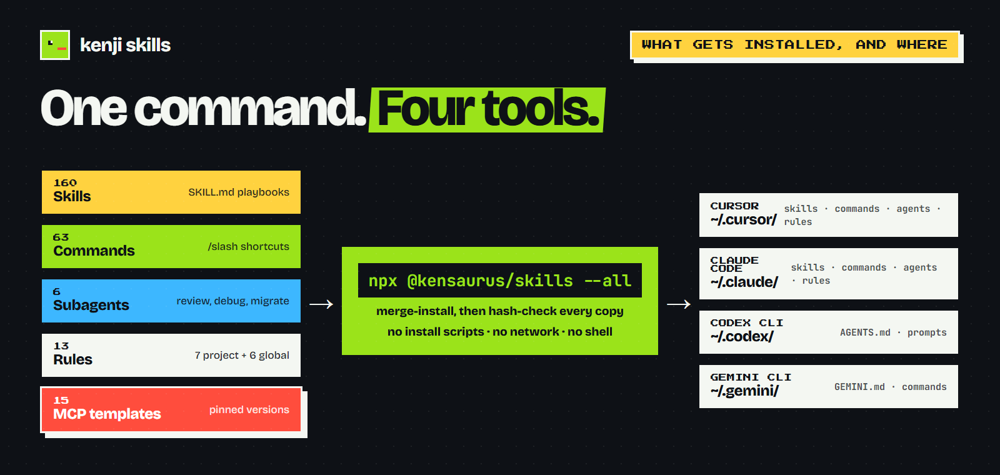
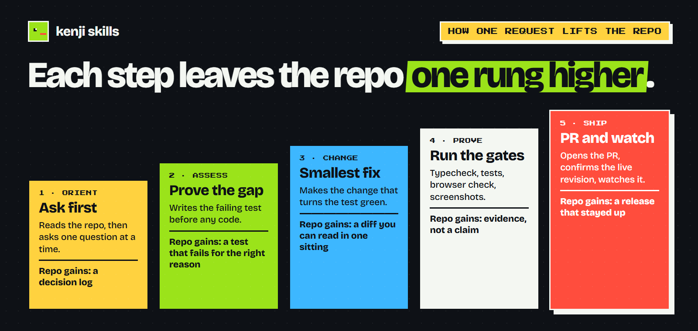
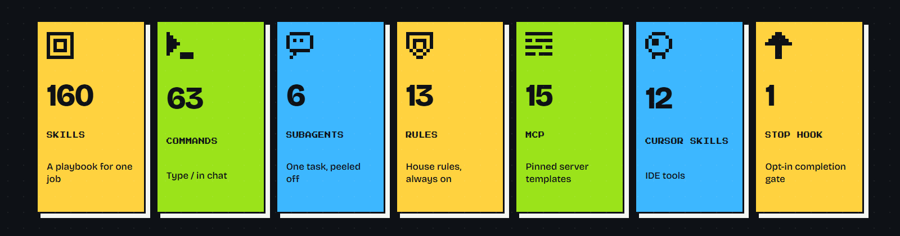

<div align="center">


# kenji skills

**You say the job. The playbook runs.** Agent skills, slash commands, and subagents for **Claude Code, Cursor, Codex CLI, and Gemini CLI**.

160 agent skills · 63 slash commands · 15 MCP servers · 12 Cursor skills · 6 subagents — for React / Next.js / Supabase, usable on almost any stack.

<p>
  <a href="https://www.npmjs.com/package/@kensaurus/skills"></a>
  <a href="https://www.skills.sh/kensaurus/skills"></a>
  
</p>

<a href="docs/GETTING-STARTED.md" title="First-time guide">
  <picture>
    <source media="(prefers-color-scheme: dark)" srcset="docs/screenshots/hero-dark.png">
    <source media="(prefers-color-scheme: light)" srcset="docs/screenshots/hero-light.png">
    
  </picture>
</a>

<sub>After install, say the job in chat. The matching playbook runs, proves the result, and opens the PR. The image follows your GitHub theme.</sub>

</div>

##  Install (30 seconds)

```bash
npx @kensaurus/skills --all
```

<picture>
  <source media="(prefers-color-scheme: dark)" srcset="docs/screenshots/architecture-dark.png">
  <source media="(prefers-color-scheme: light)" srcset="docs/screenshots/architecture-light.png">
  
</picture>

One command merge-installs skills, slash commands, agents, and rules into every tool it finds, then hash-checks every copy. The installer has no install scripts, opens no network connection, and runs no shell. Restart Cursor. Done.

> Skills only? `npx skills add kensaurus/skills`. Claude Code plugin? `/plugin marketplace add kensaurus/skills` then `/plugin install kenji@kenji`. All flags → [Install options](#install-options). New to this? **[Plain-language guide →](docs/GETTING-STARTED.md)**. Renamed from `cursor-kenji` in 2.0.0 → [Upgrading](#upgrading-from-cursor-kenji).

##  How one request lifts the repo

<picture>
  <source media="(prefers-color-scheme: dark)" srcset="docs/screenshots/ladder-dark.png">
  <source media="(prefers-color-scheme: light)" srcset="docs/screenshots/ladder-light.png">
  
</picture>

Every playbook walks the same five rungs. Assess before you change. Prove before you ship.

| Rung | What runs | What the repo gains |
|:-----|:----------|:--------------------|
| **Orient** | `workflow-onboard`, `/research` | A decision log |
| **Assess** | `audit-*`, `plan-*`, `/grill-me` | A failing test, or a plan you approve |
| **Change** | `design-*`, `enhance-*`, `backend-*`, `housekeep-*` | A diff you can read in one sitting |
| **Prove** | `test-*`, `complete-everything`, `completion-judge` | Evidence, not a claim |
| **Ship** | `workflow-ship-and-observe`, `deploy-*`, `debug-*` | A release that stayed up |

The 23 `plan-*` skills audit first and wait for your approval. See [docs/PLAN-LOOPS.md](docs/PLAN-LOOPS.md).

##  What should I say?

| You say… | What kicks in | What you get |
|:---------|:--------------|:-------------|
| *"orient me"* | `workflow-onboard` | A short tour of the codebase |
| *"grill me before I build"* | `workflow-grilling` | One question at a time until you're aligned |
| *"build this feature"* | `workflow-build-feature` | Spec → tests → code → smoke → PR |
| *"fix this bug and ship it"* | `workflow-fix-and-ship` | Debug → fix → verify → PR → deploy |
| *"this mobile app feels like a website"* | `enhance-mobile-native-feel` | Native chrome, haptics, motion, lists, in one pass |
| *"audit my security"* | `audit-security` | OWASP-style findings with file:line |
| *"is this production-ready?"* | `audit-resilience` + `audit-realworld` | Timeouts, retries, parity checks |
| *"complete everything"* | `complete-everything` | No parked leftovers; a judge verifies "done" |
| *"ship it and watch it"* | `workflow-ship-and-observe` | Deploy → verify live → observe / rollback |
| *"take this to market"* | `workflow-gtm` | GTM plan → approve → analytics, hero, onboarding, SEO, launch kit |

To force a skill: *"use `enhance-web-ux` on `/dashboard`"*. Every trigger phrase → [docs/CATALOG.md](docs/CATALOG.md).

##  Tour

Four examples. The rule is the same: you say the job, and a named playbook runs.

<table>
  <tr>
    <td width="50%" align="center">
      <a href="docs/GETTING-STARTED.md#a-typical-session">
        
      </a>
      <br>
      <sub><b>Grill</b> · <code>workflow-grilling</code> asks one question at a time. You approve a decision log before any code.</sub>
    </td>
    <td width="50%" align="center">
      <a href="docs/CATALOG.md#workflow-build-feature">
        
      </a>
      <br>
      <sub><b>Build</b> · <code>workflow-build-feature</code> writes the spec and the failing test first. Then the code, then the PR.</sub>
    </td>
  </tr>
  <tr>
    <td width="50%" align="center">
      <a href="docs/CATALOG.md#audit-security">
        
      </a>
      <br>
      <sub><b>Audit</b> · <code>audit-security</code> reports each finding with a file and line. No vibe checks.</sub>
    </td>
    <td width="50%" align="center">
      <a href="docs/CATALOG.md#workflow-ship-and-observe">
        
      </a>
      <br>
      <sub><b>Ship</b> · <code>workflow-ship-and-observe</code> confirms the live revision, watches the window, and rolls back if it breaks.</sub>
    </td>
  </tr>
</table>

##  What's inside

<picture>
  <source media="(prefers-color-scheme: dark)" srcset="docs/screenshots/pieces-dark.png">
  <source media="(prefers-color-scheme: light)" srcset="docs/screenshots/pieces-light.png">
  
</picture>

Skills run from a plain request. Commands start with `/`. Subagents peel off one task. Rules are `.mdc` files the AI always obeys. MCP templates pin exact server versions. Details for each → [Commands, subagents, MCP, rules](#commands-subagents-mcp-rules).

Everything follows the [Agent Skills spec](https://agentskills.io/specification) and is checked on every commit (`npm test` covers all **172** installable skills). MCP templates pin exact versions against [package-hallucination attacks](https://labs.cloudsecurityalliance.org/research/csa-research-note-slopsquatting-ai-supply-chain-20260419-csa/).

<!-- SKILL-INDEX:START -->

#### Skill families at a glance

| Family | Count | In one sentence |
|:-------|------:|:----------------|
| [Audit — inspect; some then fix](docs/SKILLS.md#audit-inspect-some-then-fix-32) | **32** | Check the codebase: security, UX, analytics, IAP, the skill pack |
| [Plan — audit first, change only after you approve](docs/SKILLS.md#plan-audit-first-change-only-after-you-approve-23) | **23** | Write a fix plan you approve before any code changes |
| [Enhance — improve what already exists](docs/SKILLS.md#enhance-improve-what-already-exists-23) | **23** | Polish UI, forms, motion, SEO, PWA, email deliverability |
| [Design — build something new](docs/SKILLS.md#design-build-something-new-10) | **10** | Create new UI, APIs, emails, themes from scratch |
| [Backend — server & data patterns](docs/SKILLS.md#backend-server-data-patterns-5) | **5** | Auth, caching, queues, realtime, observability |
| [Mobile — React Native / Capacitor](docs/SKILLS.md#mobile-react-native-capacitor-5) | **5** | RN screens, emulators, Capacitor, App Store prep |
| [Data — charts & pipelines](docs/SKILLS.md#data-charts-pipelines-2) | **2** | Charts, dashboards, ETL / cron jobs |
| [Docs — write it down clearly](docs/SKILLS.md#docs-write-it-down-clearly-6) | **6** | READMEs, PRDs, RFCs with a reader-first voice |
| [Housekeeping — consolidate or clear one drifted register](docs/SKILLS.md#housekeeping-consolidate-or-clear-one-drifted-register-5) | **5** | Consolidate one drifted register (gates, backlog, design tokens, dead code) |
| [Workflows — multi-step recipes](docs/SKILLS.md#workflows-multi-step-recipes-21) | **21** | End-to-end recipes (build, fix, ship, green the repo) |
| [Test & QA — prove it works](docs/SKILLS.md#test-qa-prove-it-works-8) | **8** | Unit, Playwright, visual regression, load, red-team |
| [Deploy — ship & verify](docs/SKILLS.md#deploy-ship-verify-2) | **2** | npm release + post-deploy smoke tests |
| [Debug — find & fix what's broken](docs/SKILLS.md#debug-find-fix-whats-broken-3) | **3** | Errors, Sentry, frontend-backend mismatches |
| [Iterate — close the loop after launch](docs/SKILLS.md#iterate-close-the-loop-after-launch-3) | **3** | Post-launch feedback loops and agent-harness iteration |
| [Mushi Mushi — bug triage helpers](docs/SKILLS.md#mushi-mushi-bug-triage-helpers-2) | **2** | Integrate the Mushi Mushi bug-report pipeline |
| [Protocols — session guardrails](docs/SKILLS.md#protocols-session-guardrails-1) | **1** | Keep browser automation from freezing |
| [Authoring — build skills & MCP](docs/SKILLS.md#authoring-build-skills-mcp-2) | **2** | Author new skills or MCP servers |
| [Third-party (upstream-maintained)](docs/SKILLS.md#third-party-upstream-maintained-3) | **3** | Vendored upstream skills (Emil, UI/UX Pro Max, Vercel WIG) |
| [Core & cross-cutting](docs/SKILLS.md#core-cross-cutting-4) | **4** | Close everything, burndown, research, handoff |
| [Cursor IDE skills](docs/SKILLS.md#cursor-ide-skills-12) | **12** | Canvas, hooks, rules, PR splitter, CLI helpers |
| **Total** | **172** | [Every skill, one line each](docs/SKILLS.md) |

_Generated from each skill's `SKILL.md` by `npm run gen:skill-index`. **172 skills.** The full list is [docs/SKILLS.md](docs/SKILLS.md); trigger phrases are in [docs/CATALOG.md](docs/CATALOG.md)._

<!-- SKILL-INDEX:END -->

##  Install options

| Method | Command | What it installs |
|:-------|:--------|:-----------------|
| **npm installer** (full pack) | `npx @kensaurus/skills --all` | Skills + commands + agents + rules. `--all` = Cursor + Claude + Codex + Gemini |
| **skills.sh** (skills only) | `npx skills add kensaurus/skills` | `SKILL.md` folders only. Project-local by default; `-g` for `~/.cursor/skills` |
| **Claude Code plugin** | `/plugin marketplace add kensaurus/skills` then `/plugin install kenji@kenji` | This repo as a marketplace |
| **Clone** | `git clone https://github.com/kensaurus/skills.git && cd skills && ./install.sh` | Same as the npm installer |

<details>
<summary><b>All installer flags</b></summary>

```bash
npx @kensaurus/skills            # merge: add or overwrite this repo's items (Cursor)
npx @kensaurus/skills --auto     # detect installed tools and install to each
npx @kensaurus/skills --claude   # Claude Code (~/.claude/)
npx @kensaurus/skills --codex    # Codex CLI (~/.codex/AGENTS.md + prompts)
npx @kensaurus/skills --gemini   # Gemini CLI (~/.gemini/GEMINI.md + commands)
npx @kensaurus/skills --all      # all four tools in one run
npx @kensaurus/skills --clean    # mirror ~/.cursor to match this repo (backup first)
npx @kensaurus/skills --dry-run  # preview
npx @kensaurus/skills --verify   # hash-check destinations against this package
npx @kensaurus/skills --skill audit-ux   # one skill
npx @kensaurus/skills --link     # dev: symlink for live skill authoring
```

More flags (`--restore`, `--only`, `--no-agents-mirror`): `npx @kensaurus/skills --help`. The bare command stays Cursor-only; `--auto` checks `~/.cursor`, `~/.claude`, `~/.codex`, and `~/.gemini` and installs to each one it finds.

**After install:** restart Cursor; copy `mcp/mcp.json.template` to `~/.cursor/mcp.json` and set `FIRECRAWL_API_KEY`, `CONTEXT7_API_KEY`, `SUPABASE_ACCESS_TOKEN`, `SUPABASE_PROJECT_REF`; then describe any task.

**Keep fresh:** `npx @kensaurus/skills --all && npx @kensaurus/skills --verify --all`.

</details>

<details>
<summary><b>Claude Code</b></summary>

All skills, commands, agents, and rules install to `~/.claude/`, with `.mdc` rules installed as `.md`. Skills appear as `/slash-commands` (`/workflow-build-feature`, `/debug-error the login endpoint returns 401`, `/plan-security-audit`). Re-run the installer any time; Claude Code reads file changes at the start of each session.

**Model and effort.** Claude Code 2.1.280+ defaults to Claude Opus 5.5. Its effort default is `medium`, and thinking cannot be switched off, so effort is the only thinking control. Set it with `/effort <low|medium|high|xhigh|max>`, per-model `modelSettings`, or a skill's `effort:` key. Pack convention: audit, plan, judge, debug, and security skills at `high`; implementation at the `medium` default; inventory and `/handoff` at `low`. Cursor ignores the `effort:` key. Full story → [docs/MODEL-AND-EFFORT.md](docs/MODEL-AND-EFFORT.md).

</details>

<details>
<summary><b>Codex CLI and Gemini CLI</b></summary>

Neither tool has a skills system yet. Each reads one global context file: `~/.codex/AGENTS.md` and `~/.gemini/GEMINI.md`. Your `rules/` merge into that file; three playbooks (`plan-mode`, `research`, `fix-issue`) ship as native prompts (`~/.codex/prompts/*.md`) or commands (`~/.gemini/commands/*.toml`). Skills and subagents are not written out because neither tool can load them. An existing `AGENTS.md` or `GEMINI.md` is backed up as `.bak-<stamp>` first. `install.sh --codex` and `--gemini` delegate to the Node installer (Node 18 or newer).

</details>

<details>
<summary><b>Optional: Mushi Mushi bug-report triage</b></summary>

```bash
npx skills add kensaurus/mushi-mushi
```

Pairs with `mushi-health` and `test-playwright`. Repo: [kensaurus/mushi-mushi](https://github.com/kensaurus/mushi-mushi).

</details>

##  Commands, subagents, MCP, rules

<details>
<summary><b>Commands (63)</b> — type <code>/</code> in chat to see them all</summary>

| Command | When | What |
|:--------|:-----|:-----|
| `/burndown-full` | A refactor stopped early | Drive the plan to 100% repo coverage with a verification gate |
| `/complete-everything` | A plan marked done with deferrals | Close planned, parked, and discovered work; run the test ladder |
| `/green-repo` | Whole-repo debt cleanup | Drive typecheck, lint, test, and build to green |
| `/ship-and-observe` | Deploy to production | Verify the live revision, watch the window, roll back if needed |
| `/feedback-to-closure` | Reports, QA, Sentry | Dedupe into tickets, fix, verify in production |
| `/plan-mode` | Before coding | Research + approved plan (`/plan` is the host mode switch) |
| `/commit` · `/pr` · `/fix-issue [#]` | Git flow | Lint and commit · push and open PR · issue to fix to PR |
| `/debug-issue` · `/review-code` · `/test` | Quality | Runtime evidence · review · route to the matching test skill |
| `/research` · `/readme` · `/refactor` · `/update-deps` | Maintenance | Doc research · README sync · modular split · safe dep updates |
| `/uiux` · `/readability` · `/responsive-audit` · `/instant-nav` | UI | Design system · reading load · breakpoints · instant navigation |
| `/deadcode` | Unused files, exports, deps | Knip baseline, then delete by category behind a shrink-only ratchet |
| `/gtm` · `/gtm-weekly` · `/launch-kit` | Growth | GTM plan and loop · weekly review · launch copy from verified claims |
| `/skill-conflicts` · `/mcp-guide` | Pack hygiene | Overlapping triggers · MCP tool reference |
| `/*-plan` (23 aliases) | Audit before changing | Thin pointers to the `plan-*` skills; audit and plan only |

RN monorepo bundle: copy `commands/native-rn-monorepo/` and `rules/native-rn-monorepo/` into your project (iOS builds on CI). Full command list → [docs/CATALOG.md](docs/CATALOG.md#commands-63).

</details>

<details>
<summary><b>Subagents (6)</b></summary>

| Agent | Triggers on | Output |
|:------|:------------|:-------|
| `code-reviewer` | "review", code changes | Quality, security, types |
| `debugger` | Errors, exceptions | Root cause + fix |
| `db-migrator` | "migration", "new table" | SQL, RLS, indexes |
| `deploy-checker` | "deploy", "ship it" | Pre-deploy validation |
| `perf-monitor` | "slow", "optimize" | Perf audit |
| `completion-judge` | A closure claim | PASS / CONTINUE / BLOCKED against plan, state, diff, and fresh evidence |

`complete-everything` also installs an opt-in stop hook. On Claude Code 2.1.139+ the same run starts with `/goal`.

</details>

<details>
<summary><b>MCP servers (15)</b></summary>

```bash
cp ~/skills/mcp/mcp.json.template ~/.cursor/mcp.json      # essential 3
cp ~/skills/mcp/mcp-full.json.template ~/.cursor/mcp.json  # all 15
```

Set `FIRECRAWL_API_KEY`, `CONTEXT7_API_KEY`, `SUPABASE_ACCESS_TOKEN`, and `SUPABASE_PROJECT_REF` in the environment. Slack and Notion in the full template still use `YOUR_*`. Setup → [mcp/README.md](mcp/README.md).

| Tier | Servers | Keys? |
|:-----|:--------|:------|
| Essential | Firecrawl, Context7, Supabase | Firecrawl + Context7 + Supabase |
| Dev | GitHub, GitHub Official, Playwright, Postgres, Memory, Chrome DevTools | PAT / conn string |
| Cloud | AWS Lambda, S3, CloudWatch, Redis | AWS profile / URL |
| Productivity | Slack, Notion | Bot token / API key |

</details>

<details>
<summary><b>Project rules (7) and global rules</b></summary>

```bash
cp ~/skills/rules/project-starter/*.mdc your-project/.cursor/rules/
```

| Rule | Enforces |
|:-----|:---------|
| `supabase.mdc` | Typed clients, RLS, migrations |
| `typescript.mdc` | No `any`, Zod, ActionResult |
| `components.mdc` | Primitives, Server Components, a11y |
| `tailwind.mdc` | Tokens, mobile-first |
| `data-fetching.mdc` | TanStack Query, RSC prefetch, `'use cache'` |
| `web-performance.mdc` | LCP priority, INP yield, bfcache, budgets |
| `git.mdc` | Conventional commits, no secrets |

Global rules the pack installs: `full-stack-ship-discipline.mdc`, `approved-plan-execution.mdc`, `skill-workflows.mdc`, `senior-engineer.mdc`, `verification-before-completion.mdc`, `shell-first-search.mdc`. Plan at high effort, execute at the medium default under `approved-plan-execution.mdc`, judge in a fresh context. **Project constitution:** copy [docs/AGENTS.template.md](docs/AGENTS.template.md) to your app repo as `AGENTS.md`.

Plan → apply pairs: `plan-uiux-unification` → `housekeep-design`; `plan-dead-code` → `housekeep-dead-code`; `plan-gtm` → `workflow-gtm`. The plan half audits and stops; the apply half changes the repo only against an approved list. Third-party skills are prefixed `thirdparty-*` with `ATTRIBUTION.md` → [docs/THIRD-PARTY-SKILLS.md](docs/THIRD-PARTY-SKILLS.md).

</details>

<details>
<summary><b>Shell helpers and repository layout</b></summary>

```bash
source ~/skills/shell-aliases/cursor-helpers.sh
```

`newskill <name>` · `lsskills` · `cursor-sync` · `cursor-dev` · `newrule <name>` · `newagent <name>` · `gc <type> <msg>` · `gp`. Definitions in [shell-aliases/cursor-helpers.sh](shell-aliases/cursor-helpers.sh) (clone only).

```
skills/
├── skills/           # 160 Agent Skills (SKILL.md each)
├── skills-cursor/    # 12 Cursor-specific skills
├── commands/         # 63 slash commands
├── agents/           # 6 subagents
├── hooks/            # opt-in completion stop gate
├── rules/            # Global + project-starter rules
├── mcp/              # MCP templates
├── docs/             # SKILLS, CATALOG, PLAN-LOOPS, GETTING-STARTED, …
├── notepads/         # Context templates (clone only)
├── shell-aliases/    # Bash helpers (clone only)
├── scripts/          # validate-skills, check-skill-count, render-brand-assets
└── bin/install.mjs   # npm installer
```

</details>

##  Upgrading from cursor-kenji

2.0.0 renamed the pack: repo `kensaurus/cursor-kenji` → `kensaurus/skills`, npm `@kensaurus/cursor-kenji` → `@kensaurus/skills`, plugin `cursor-kenji@cursor-kenji` → `kenji@kenji`, slash namespace `/cursor-kenji:` → `/kenji:`. Old GitHub URLs redirect.

<details>
<summary><b>What to run once</b></summary>

| You installed with | Do this once |
|---|---|
| `npx @kensaurus/cursor-kenji` | `npx @kensaurus/skills --all`. The installer moves its Stop hook from `cursor-kenji-hooks/` to `kenji-hooks/` and removes the old copy. |
| `npx skills add kensaurus/cursor-kenji` | `npx skills add kensaurus/skills`. Old installs still update through the GitHub redirect. |
| Claude Code plugin | Existing installs keep loading under the new name. For the clean ID: `/plugin marketplace remove cursor-kenji`, `/plugin marketplace add kensaurus/skills`, `/plugin install kenji@kenji`. |
| A clone | `git remote set-url origin https://github.com/kensaurus/skills.git` |

`CURSOR_KENJI_GATE_STATE_DIR` and `CURSOR_KENJI_DIR` still work; the new names are `KENJI_GATE_STATE_DIR` and `KENJI_SKILLS_DIR`.

</details>

##  FAQ

<details>
<summary><b>How do skills trigger? How do I force one?</b></summary>

You talk normally. The tool matches your words to each skill's YAML `description`. To force one: *"use `audit-security` on this repo"*. Full trigger list: [docs/CATALOG.md](docs/CATALOG.md).

</details>

<details>
<summary><b>What is the difference between <code>audit-*</code> and <code>plan-*</code>?</b></summary>

`audit-*` reports findings and stops by default. Six audit-and-fix skills (`audit-responsive`, `audit-code-quality`, `audit-performance`, `audit-security`, `audit-i18n`, `audit-bundle-size`) fix what they find. `plan-*` only writes a `plan-{name}.md` burndown; you approve each phase before any code changes. See [docs/PLAN-LOOPS.md](docs/PLAN-LOOPS.md).

</details>

<details>
<summary><b>How many skills, and where do the counts come from?</b></summary>

**160** agent skills in `skills/` plus **12** Cursor-specific skills in `skills-cursor/` (**172** total). Counts come from the filesystem via `npm run check:skills`. See the [family table](#skill-families-at-a-glance) and [docs/SKILLS.md](docs/SKILLS.md).

</details>

<details>
<summary><b>Where do MCP API keys go? Is there an llms.txt?</b></summary>

Copy `mcp/mcp.json.template` to `~/.cursor/mcp.json` and set the env vars; never commit real keys ([SECURITY.md](SECURITY.md), [mcp/README.md](mcp/README.md)). Machine-readable docs: [llms.txt](llms.txt).

</details>

##  Contributing

```bash
mkdir -p skills/my-skill && vim skills/my-skill/SKILL.md
npm test   # validate + count + index + install smoke
```

Each skill passes [Agent Skills spec](https://agentskills.io/specification) validation (`npm run validate:skills`): `name` matches the directory, `description` ≤ 320 chars, body under 500 lines. See [CONTRIBUTING.md](CONTRIBUTING.md), [docs/README.md](docs/README.md), [docs/DISTRIBUTION.md](docs/DISTRIBUTION.md), [docs/CATALOG.md](docs/CATALOG.md), [docs/TRIGGER-CHEATSHEET.md](docs/TRIGGER-CHEATSHEET.md).

## Alternatives

- [awesome-cursorrules](https://github.com/PatrickJS/awesome-cursorrules): curated rules collections
- [skills.sh](https://www.skills.sh/kensaurus/skills): this pack's live skills page
- [SkillsMP](https://skillsmp.com/creators/kensaurus/cursor-kenji): aggregator crawl of this repo
- [agentskills.io](https://agentskills.io): the Agent Skills spec

kenji ships executable skills, MCP configs, commands, and subagents in one installable package, not static rules alone. Listed vs submitted → [docs/DISTRIBUTION.md](docs/DISTRIBUTION.md).

## More from KENSAURUS

<table>
  <tr>
    <td width="50%" valign="top">
      
      <b>glot.it</b> · A Thai tutor that talks back.<br>
      <sub><a href="https://apps.apple.com/us/app/glot-it/id6761582648">App Store: glot.it</a> · <a href="https://play.google.com/store/apps/details?id=com.glotit.app">Google Play: glot.it – Learn Thai</a> · <a href="https://kensaur.us/glot-it/?utm_source=github&utm_medium=readme">Web</a></sub>
    </td>
    <td width="50%" valign="top">
      
      <b>yen-yen</b> · Mindful money for two. A kakeibo with no bank login and no ads.<br>
      <sub><a href="https://apps.apple.com/app/id6764548441">App Store: yen-yen – Expense Tracker</a> · <a href="https://play.google.com/store/apps/details?id=app.yenyen">Google Play: yen-yen – Expense Tracker</a> · <a href="https://kensaur.us/yen-yen/?utm_source=github&utm_medium=readme">Web</a></sub>
    </td>
  </tr>
  <tr>
    <td valign="top">
      
      <b>the wanting mind</b> · A free living book on why we want what we want. Read it, hear it, ask it questions.<br>
      <sub><a href="https://apps.apple.com/us/app/the-wanting-mind/id6761361305">App Store: the wanting mind – Living Book</a> · <a href="https://play.google.com/store/apps/details?id=us.kensaur.thewantingmind">Google Play: the wanting mind – Living Book</a> · <a href="https://kensaur.us/the-wanting-mind/?utm_source=github&utm_medium=readme">Web</a></sub>
    </td>
    <td valign="top">
      
      <b>Help Her Take Photo</b> · A pose coach for couple photos. See her camera live on your phone.<br>
      <sub><a href="https://apps.apple.com/app/help-her-take-photo/id6762513666">App Store: Help Her Take Photo</a> · <a href="https://play.google.com/store/apps/details?id=com.kensaurus.helphertakephoto">Google Play: help her take photo – Pose Cam</a> · <a href="https://kensaur.us/help-her-take-photo/?utm_source=github&utm_medium=readme">Web</a></sub>
    </td>
  </tr>
  <tr>
    <td valign="top">
      
      <b>lets-talk</b> · Practice hard conversations before you have them, scored.<br>
      <sub><a href="https://play.google.com/store/apps/details?id=us.kensaur.howtotalktogirls">Google Play: lets-talk – Conversation Coach</a> · <a href="https://talk.kensaur.us/?utm_source=github&utm_medium=readme">Web</a></sub>
    </td>
    <td valign="top">
      
      <b>一人社長 Solo Boss</b> · Accounting that mostly runs itself, for one-person companies in Japan.<br>
      <sub><a href="https://solo-boss.kensaur.us/?utm_source=github&utm_medium=readme">Web</a></sub>
    </td>
  </tr>
  <tr>
    <td valign="top">
      
      <b>Tsumagoi Work&amp;Camp 嬬恋牧場</b> · A bookable mountain campground at 1,444 m, built end to end.<br>
      <sub><a href="https://tsumagoi.kensaur.us/?utm_source=github&utm_medium=readme">Web</a> · <a href="https://www.instagram.com/tsumagoicamp/">Instagram</a> · <a href="https://maps.app.goo.gl/JCNnTfsdQVHCS1FA7">Maps</a></sub>
    </td>
    <td valign="top">
      
      <b>Mushi Mushi</b> · Open-source in-app bug reporting SDK. Bug intel for when the graphs lie.<br>
      <sub><a href="https://www.npmjs.com/package/mushi-mushi">npm</a> · <a href="https://github.com/kensaurus/mushi-mushi">GitHub</a></sub>
    </td>
  </tr>
</table>

All apps on Google Play: [kensaurus developer page](https://play.google.com/store/apps/developer?id=kensaurus). Everything else: [kensaur.us](https://kensaur.us/?view=portfolio&utm_source=github&utm_medium=readme).

---

<p align="center">
  <strong>MIT License</strong> · Apache-2.0 portions noted in <a href="NOTICE">NOTICE</a><br/>
  <em><a href="https://github.com/kensaurus">@kensaurus</a> · <a href="CHANGELOG.md">Changelog</a> · <a href="https://github.com/kensaurus/skills/discussions">Discussions</a></em>
</p>
